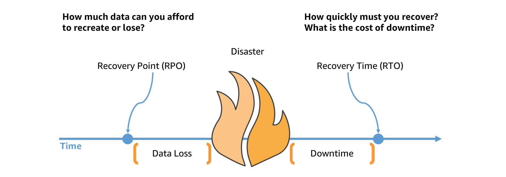

# Design reliable and resilient architectures

## Recovery Time Objectives (RTOs) and recovery point obectives (RPOs)

> RTO stands for Recovery Time Objective and is a measure of how quickly after an outage an application must be available again  

> RPO, or Recovery Point Objective, refers to how much data loss your application can tolerate. Another way to think about RPO is how old can the data be when this application is recovered?

## AWS Elastic Disaster Recovery

> Your data is replicated to a staging area subnet in your AWS account, in the AWS Region you select. The staging area design reduces costs by using affordable storage and minimal compute resources to maintain ongoing replication. You can perform non-disruptive tests to confirm that implementation is complete.

## Pilot light and warm standby

Pilot light and Warm standby and full multi-site represent the spectrum of commitment of recovery resources. Pilot light: data backup's with resources spun down, awaiting activation upon disaster. This reduces costs but has a slower recovery time. Warm Standby is pilot light with some minimal resources spun up so recovery is quicker. Multi-site is a full duplication of the system, which will cost in the region of the same. 

 

