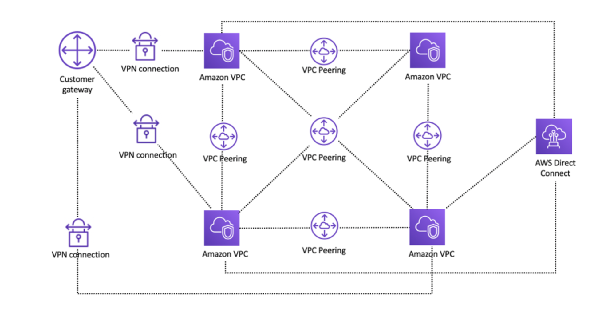
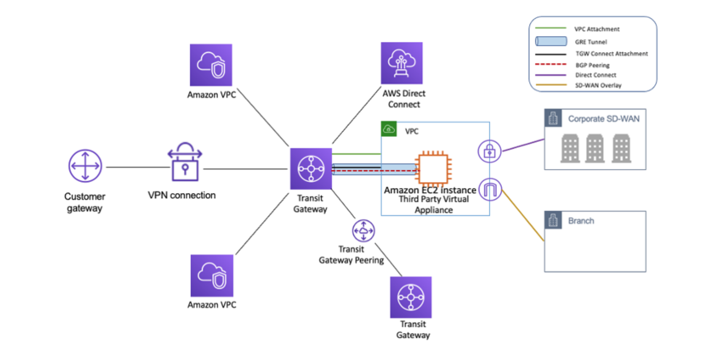
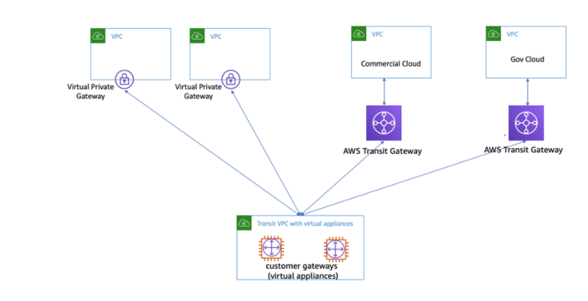

# AWS Architecture Connectivity Stratergies

## AWS Direct Connect

**AWS Direct Connect**: Allow you to connect you on-prem services to AWS directly (not via internet). This can be achieved by using one of the pre-approved data centers. It's the fastet way to connect you serveces to thoses in the AWS cloud. Allows connection to different Avalability Zones, without going via the web.

**MAC Security**: 

> MAC Security (MACsec) is an IEEE standard that provides data confidentiality, data integrity, and data origin authenticity. You can use AWS Direct Connect connections that support MACsec to encrypt your data from your corporate data center to the AWS Direct Connect location. All data flowing across the AWS global network that interconnects with datacenters and Regions is automatically encrypted at the physical layer before it leaves the data center.

[AWS Docs][1] 

**Direct Connect Site Link**

Connect two of your sites via AWS Direct Connect so your service can communicate withought communication over the internet.

> SiteLink, a new feature of AWS Direct Connect (DX), makes it easy to send data from one Direct Connect location to another, bypassing AWS Regions. If you recall, Direct Connect is a cloud service that links your network to AWS, bypassing the internet to deliver more consistent, lower-latency performance. Prior to SiteLink, it was not possible to route traffic directly between Direct Connect locations. Now, you can create global, reliable, and pay-as-you-go connections between the offices and data centers in your global network by sending data over the fastest path between AWS Direct Connect locations.

[AWS Docs][2]

## AWS VPN

**AWS Client VPN**: Connect your on prem services to the AWS cloud using and encryted link (Virtual Private Network), fully managed and elastic, scales with use.

AWS site-to-site VPN a secure connection between data centers, offices and AWS resources. 
AWS Accelarate site-to-site VPN adds in global accelarator.

[AWS Docs][3]

## Transitive Routing

Different stratergy for conneting VPCs

**VPC Peering**: A VPC peer connection enables bi-directional traffic from 2 VPC even if in different subscriptions of Zones. Note you can't chain VPCs using peering to create a pathway through multiple VPCs

> VPC peering is point-to-point connectivity, and it does not support transitive routing. For example, if you have a VPC peering connection between VPC A and VPC B and between VPC A and VPC C, an instance in VPC B cannot transit through VPC A to reach VPC C. To route packets between VPC B and VPC C, you are required to create a direct VPC peering connection. 

**Transit Gateway**: Connect VPCs via a central transit gateway

**Transitive VPC**: Use a VPC as a hub that sits in the middle of the VPC's

> Transit VPCs can solve some of the shortcomings of VPC peering by introducing a hub and spoke design for inter-VPC connectivity. In a transit VPC network, one central VPC (the hub VPC) connects with every other VPC (spoke VPC) through a VPN connection typically leveraging BGP over IPsec. The central VPC contains Amazon Elastic Compute Cloud (Amazon EC2) instances running software appliances that route incoming traffic to their destinations using the VPN overlay.

[AWS Docs][4]

## AWS ECS Serivce Connect

> Amazon ECS Service Connect provides management of service-to-service communication as Amazon ECS configuration.

Using AWS Cloud Map, namespaces and local service names. ECS can be configured for seemles distrabuted traffic between ECS tasks witout needing load balencers.

> The Service Connect feature creates a virtual network of related services. The same service configuration can be used across multiple different namespaces to run independent yet identical sets of applications. 

> Windows containers aren't supported with Service Connect.

[AWS Docs][5]

[1]: <https://docs.aws.amazon.com/directconnect/latest/UserGuide/MACsec.html> "AWS MACSec"
[2]: <https://aws.amazon.com/blogs/networking-and-content-delivery/introducing-aws-direct-connect-sitelink/> "AWS Site Link"
[3]: <https://aws.amazon.com/vpn/> "AWS VPN"
[4]: <https://docs.aws.amazon.com/whitepapers/latest/building-scalable-secure-multi-vpc-network-infrastructure/transit-vpc-solution.html> "Transit VPC"
[5]: <https://docs.aws.amazon.com/AmazonECS/latest/developerguide/service-connect.html> "AWS ECS Service Connect"
