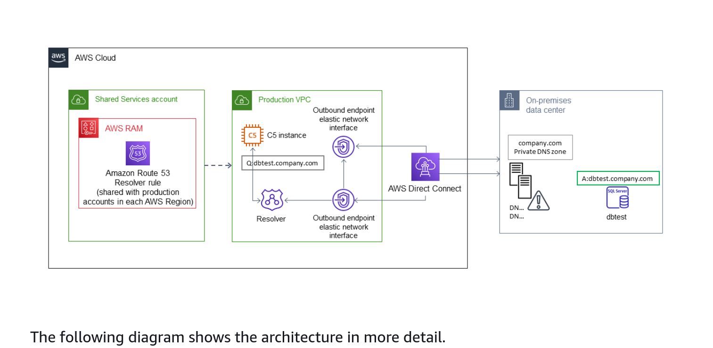
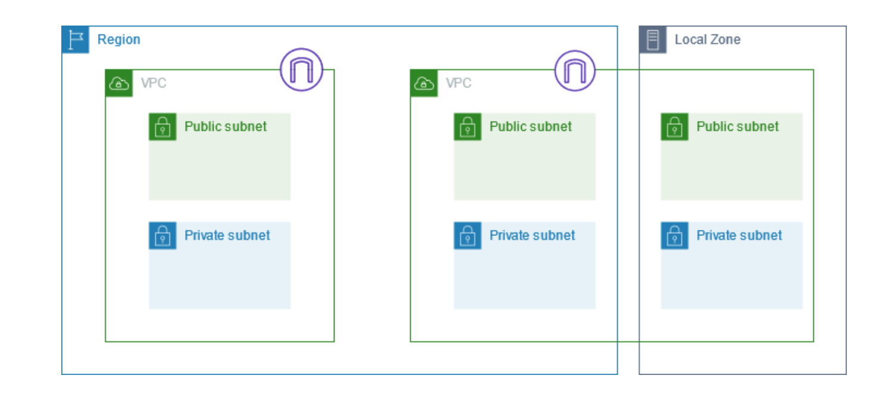
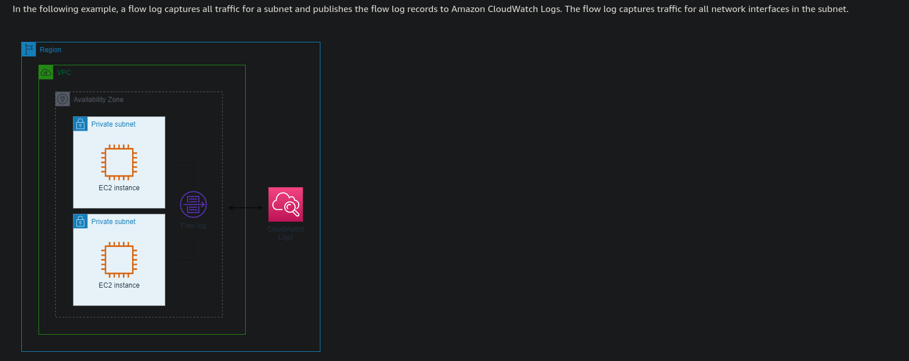

# AWS Architecture Connectivity Strategies

## AWS Direct Connect

**AWS Direct Connect**: Allow you to connect you on-prem services to AWS directly (not via internet). This can be achieved by using one of the pre-approved data centers. It's the fastest way to connect you services to those in the AWS cloud. Allows connection to different Availability Zones, without going via the web.

**MAC Security**: 

> MAC Security (MACsec) is an IEEE standard that provides data confidentiality, data integrity, and data origin authenticity. You can use AWS Direct Connect connections that support MACsec to encrypt your data from your corporate data center to the AWS Direct Connect location. All data flowing across the AWS global network that interconnects with datacenters and Regions is automatically encrypted at the physical layer before it leaves the data center.

[AWS Docs][1] 

**Direct Connect Site Link**

Connect two of your sites via AWS Direct Connect so your service can communicate without communication over the internet.

> SiteLink, a new feature of AWS Direct Connect (DX), makes it easy to send data from one Direct Connect location to another, bypassing AWS Regions. If you recall, Direct Connect is a cloud service that links your network to AWS, bypassing the internet to deliver more consistent, lower-latency performance. Prior to SiteLink, it was not possible to route traffic directly between Direct Connect locations. Now, you can create global, reliable, and pay-as-you-go connections between the offices and data centers in your global network by sending data over the fastest path between AWS Direct Connect locations.

[AWS Docs][2]

## AWS VPN

**AWS Client VPN**: Connect your on prem services to the AWS cloud using and encrypted link (Virtual Private Network), fully managed and elastic, scales with use.

AWS site-to-site VPN a secure connection between data centers, offices and AWS resources. 
AWS Accelerated site-to-site VPN adds in global accelerator.

[AWS Docs][3]

## Transitive Routing

Different strategy for connecting VPCs

**VPC Peering**: A VPC peer connection enables bi-directional traffic from 2 VPC even if in different subscriptions of Zones. Note you can't chain VPCs using peering to create a pathway through multiple VPCs

> VPC peering is point-to-point connectivity, and it does not support transitive routing. For example, if you have a VPC peering connection between VPC A and VPC B and between VPC A and VPC C, an instance in VPC B cannot transit through VPC A to reach VPC C. To route packets between VPC B and VPC C, you are required to create a direct VPC peering connection. 

**Transit Gateway**: Connect VPCs via a central transit gateway

**Transitive VPC**: Use a VPC as a hub that sits in the middle of the VPC's

> Transit VPCs can solve some of the shortcomings of VPC peering by introducing a hub and spoke design for inter-VPC connectivity. In a transit VPC network, one central VPC (the hub VPC) connects with every other VPC (spoke VPC) through a VPN connection typically leveraging BGP over IPsec. The central VPC contains Amazon Elastic Compute Cloud (Amazon EC2) instances running software appliances that route incoming traffic to their destinations using the VPN overlay.

[AWS Docs][4]

## AWS ECS Service Connect

> Amazon ECS Service Connect provides management of service-to-service communication as Amazon ECS configuration.

Using AWS Cloud Map, namespaces and local service names. ECS can be configured for seamless distributed traffic between ECS tasks without needing load balancers.

> The Service Connect feature creates a virtual network of related services. The same service configuration can be used across multiple different namespaces to run independent yet identical sets of applications. 

> Windows containers aren't supported with Service Connect.

[AWS Docs][5]

## Hybrid DNS Concepts

**Route 53 Resolver** allows seamless DNS resolution across both your private network and AWS Cloud.

> Hybrid cloud is a combination of AWS Cloud and on prem servers.

[AWS Docs][6]

## Network Segmentation

**Subnetting** 

> Each subnet must reside entirely within one Availability Zone and cannot span zones. By launching AWS resources in separate Availability Zones, you can protect your applications from the failure of a single Availability Zone.

Subnets can be IPv4 IPv6 or "Dual Stack" -- both IPv4 and IPv6. These are managed by a CIDR block. IPv4 subnets cant communicate over IPv6 and vise versa.

### Subnet Security

* Security Groups: Operate at an instance level
	* Supports allow rules only
> Security groups allow inbound and outbound traffic for associated resources, such as EC2 instances. 

* Network ACL (Access Control List): Operate at a subnet level
	* Supports allow and deny rules 

> Network ACLs allow or deny inbound and outbound traffic at the subnet level. In most cases, security groups can meet your needs. However, you can use network ACLs if you want an additional layer of security.

[AWS Docs][7]

## Network Traffic Monitoring

### Flow Logs

> You can create a flow log for a VPC, a subnet, or a network interface. If you create a flow log for a subnet or VPC, each network interface in that subnet or VPC is monitored. 

[AWS Docs][8]
 
### IPAM

> Amazon VPC IP Address Manager (IPAM) is a VPC feature that makes it easier for you to plan, track, and monitor IP addresses for your AWS workloads. You can use IPAM automated workflows to more efficiently manage IP addresses.

[AWS Docs][9]

### Traffic Mirroring

> Traffic Mirroring is an Amazon VPC feature that you can use to copy network traffic from an elastic network interface of type interface. You can then send the traffic to out-of-band security and monitoring appliances.

Duplicate the traffic from a VPC interface and send it to an analysis tool.

### Reachability Analyzer

> Reachability Analyzer is a configuration analysis tool that enables you to perform connectivity testing between a source resource and a destination resource in your virtual private clouds (VPCs). When the destination is reachable, Reachability Analyzer produces hop-by-hop details of the virtual network path between the source and the destination. When the destination is not reachable, Reachability Analyzer identifies the blocking component. For example, paths can be blocked by configuration issues in a security group, network ACL, route table, or load balancer.

### Network Access Analyzer

- Understand, verify, and improve your network security posture – Network Access Analyzer helps you identify unintended network access relative to your security and compliance requirements, enabling you to take steps to improve your network security.
- Demonstrate compliance – Network Access Analyzer helps you demonstrate that your network on AWS meets your compliance requirements.

### CloudTrail

> You can use AWS CloudTrail to capture detailed information about the calls made to the Amazon VPC API. You can use the generated CloudTrail logs to determine which calls were made, the source IP address where the call came from, who made the call, when the call was made, and so on. 

Captures the event history, and store for 90 days be default. For longer persistence and more advanced analysis see [AWS CloudTrail Lake](https://docs.aws.amazon.com/awscloudtrail/latest/userguide/cloudtrail-lake.html)

[1]: <https://docs.aws.amazon.com/directconnect/latest/UserGuide/MACsec.html> "AWS MACSec"
[2]: <https://aws.amazon.com/blogs/networking-and-content-delivery/introducing-aws-direct-connect-sitelink/> "AWS Site Link"
[3]: <https://aws.amazon.com/vpn/> "AWS VPN"
[4]: <https://docs.aws.amazon.com/whitepapers/latest/building-scalable-secure-multi-vpc-network-infrastructure/transit-vpc-solution.html> "Transit VPC"
[5]: <https://docs.aws.amazon.com/AmazonECS/latest/developerguide/service-connect.html> "AWS ECS Service Connect"
[6]: <https://docs.aws.amazon.com/prescriptive-guidance/latest/patterns/set-up-dns-resolution-for-hybrid-networks-in-a-multi-account-aws-environment.html> "Hybrid DNS"
[7]: <https://docs.aws.amazon.com/whitepapers/latest/architecting-hipaa-security-and-compliance-on-amazon-eks/network-segmentation-and-hardening.html> "Subnet Security"
[8]: <https://docs.aws.amazon.com/vpc/latest/userguide/flow-logs.html#flow-log-records> "Flow Logs"
[9]: <https://docs.aws.amazon.com/vpc/latest/ipam/what-it-is-ipam.html> "IPAM"
