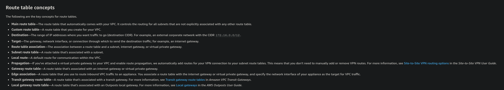
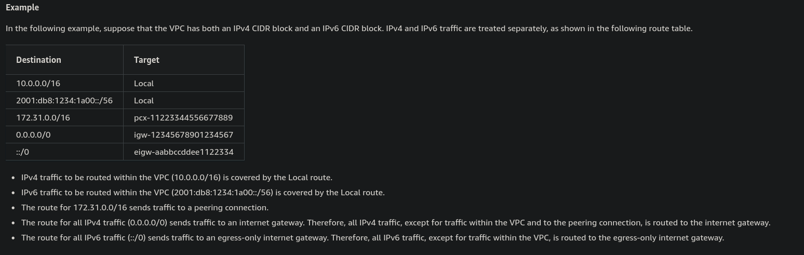

# Prescribe Security Controls

## IAM

Identity Access Management - used to control who can access you system and what they can access (Authentication and Authorisation). Authorisation is managed by Roles and polices.

### Identity Access Centre

> AWS IAM Identity Center makes it easy to centrally manage access to multiple AWS accounts and business applications. It provides your workforce with single sign-on access to all assigned accounts and applications from one place. 

### Single Sign-On (SSO)

Allows an external sign-on provider to authenticate users into AWS deployed apps and services. Types of SSO

- SAML
- OAuth
- OIDC
- Keberos

## Route Tables, Security Groups and Network ACLs

(See for initial mention of Security Groups and Network ACSs [design-solutions-for-organizational-complexity](design-solutions-for-organizational-complexity.md)

### Route Tables

> Each subnet in your VPC must be associated with a route table. A subnet can be explicitly associated with custom route table, or implicitly or explicitly associated with the main route table.

[AWS Docs][1]

## Encryption keys and certificate management

### AWS Key Management Service [KMS]

> AWS Key Management Service (AWS KMS) is a managed service that makes it easy for you to create and control the cryptographic keys that are used to protect your data. AWS KMS uses hardware security modules (HSM) to protect and validate your AWS KMS keys under the FIPS 140-2 Cryptographic Module Validation Program. China (Beijing) and China (Ningxia) Regions do not support the FIPS 140-2 Cryptographic Module Validation Program. AWS KMS uses OSCCA certified HSMs to protect KMS keys in China Regions.

[AWS Docs][2]

### Certificate Manager [ACM]

> Use AWS Certificate Manager (ACM) to provision, manage, and deploy public and private SSL/TLS certificates for use with AWS services and your internal connected resources. ACM removes the time-consuming manual process of purchasing, uploading, and renewing SSL/TLS certificates.

[AWS Docs][3]

## AWS Security, identity and compliance tools

### AWS Identity and Access Management Access Analyzer

> When you enable IAM Access Analyzer, you create an analyzer for your entire organization or your account. The organization or account you choose is known as the zone of trust for the analyzer. The analyzer monitors all of the supported resources within your zone of trust. Any access to resources by principals within your zone of trust is considered trusted. Once enabled, IAM Access Analyzer analyzes the policies applied to all of the supported resources in your zone of trust. After the first analysis, IAM Access Analyzer analyzes these policies periodically. If you add a new policy , or change an existing policy, IAM Access Analyzer analyzes the new or updated policy within about 30 minutes.

[AWS Docs][4]

### AWS Security Hub

> AWS Security Hub provides you with a comprehensive view of your security state in AWS and helps you assess your AWS environment against security industry standards and best practices.

> To help you manage the security state of your organization, Security Hub supports multiple security standards. These include the AWS Foundational Security Best Practices (FSBP) standard developed by AWS, and external compliance frameworks such as the Center for Internet Security (CIS), the Payment Card Industry Data Security Standard (PCI DSS), and the National Institute of Standards and Technology (NIST). Each standard includes several security controls, each of which represents a security best practice. Security Hub runs checks against security controls and generates control findings to help you assess your compliance against security best practices.

[AWS Docs][5]

### Amazon Inspector

> Amazon Inspector is a vulnerability management service that continuously scans your AWS workloads for software vulnerabilities and unintended network exposure. Amazon Inspector automatically discovers and scans running Amazon EC2 instances, container images in Amazon Elastic Container Registry (Amazon ECR), and AWS Lambda functions for known software vulnerabilities and unintended network exposure. 

> Amazon Inspector creates a finding when it discovers a software vulnerability or network configuration issue. A finding describes the vulnerability, identifies the affected resource, rates the severity of the vulnerability, and provides remediation guidance. You can analyze findings using the Amazon Inspector console, or view and process your findings through other AWS services. 

[AWS Docs][6]

[1]: <https://docs.aws.amazon.com/vpc/latest/userguide/VPC_Route_Tables.html> "Route Tables"
[2]: <https://docs.aws.amazon.com/kms/latest/developerguide/overview.html> "Key Management Service"
[3]: <https://aws.amazon.com/certificate-manager/> "Certificate Manger"
[4]: <https://docs.aws.amazon.com/IAM/latest/UserGuide/what-is-access-analyzer.html> "Key Management Service"
[5]: <https://docs.aws.amazon.com/securityhub/latest/userguide/what-is-securityhub.html> "AWS Security Hub"
[6]: <https://docs.aws.amazon.com/inspector/latest/user/what-is-inspector.html> "Amazon Inspector"

